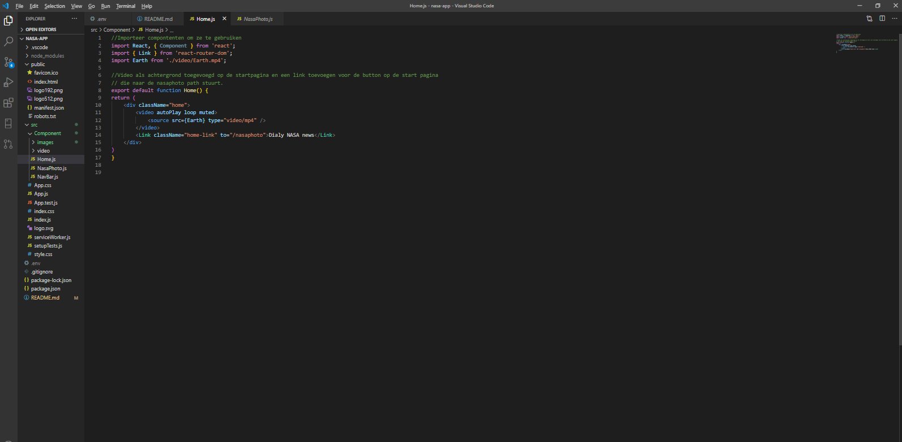

# 
 NASA React app

## Tabel met inhoud
* Introductie
* Hoe te gebruiken
* Download
* Feedback 

## Introductie
De NASA app is een app waar u elke dag een nieuws van het universem die NASA online zet. Naast het nieuws kunt u ook de bijbehorende afbeelding of video zien.

## Hoe te gebruiken
Om deze applicatie te klonen en uit te voeren, heb je Git en Node.js (die met npm meegeleverd wordt) op je computer geïnstalleerd. Vanaf uw opdrachtregel:

In de projectdirectory kun je het volgende uitvoeren:

>1. Clone deze repository:
git clone https://github.com/suly-annstokkel/nasa-app.git

> 2. Installeer dependecies:
npm install 

> 3. Bezoek de [API-pagina van NASA](https://api.nasa.gov/) en genereer een API-sleutel. Die sleutel wordt naar u gemaild.

> 5. Maak een .env-bestand in de root van het project en voer de volgende code in: **REACT_APP_NASA_KEY = "Uw API-sleutel hier!"**

> 6. Voer npm start uit [http://localhost:3000](http://localhost:3000) om de app de browser te bekijken.

De pagina wordt opnieuw geladen als u wijzigingen aanbrengt. U zult ook eventuele lint-fouten in de console zien.

### Screenshots NASA app
Dit is hoe de NASA app eruit ziet
 
 
 

### Screenshots NASA app JavaScript
 
 
 
 

## Download 
Om dit project te download kunt u terecht naar deze [link](https://github.com/suly-annstokkel/nasa-app.git) van GitHub en elke dag genieten van het NASA nieuws. 

## Leer meer
U kunt meer leren over React App op de [Create React App documentatie.](https://create-react-app.dev/docs/getting-started/) En ook tutorials over React App op [Youtube](https://www.youtube.com/) volgen. 

## Feedback 
Wees vrij om mij feedback te geven op Microsoft Teams :smile:. 